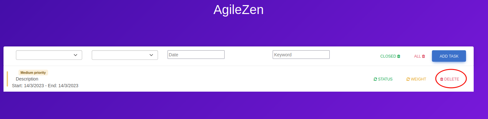

## **AgileZen** 
*POULAIN Thomas, JAMET Titouan*
***

# Installation
To install our application, you simply have to download the archive, extract it and run the index.html file.

# How to use it 

The page you just landed on by following the previous instructions should look like this:
***

***

This single page will be the core of the whole application. From here, you can add, delete, manage et take a quick overlook at all of your coming, ongoing and ended tasks in barely few seconds.
### **1) Add a task**

In the upper-right corner you can see here a button **Add Task**. Click on it to see an overlay with its form popping up. This form will ask you to submit:

- The title of the task (which can be its description)
- The start date of the task
- The deadline of the task
- The importance of the task
- The progress state of the task

> **Important note**:
>
>If you decide to close or hide the form without adding the task first, the information you already entered will be remembered for the next time you will decide to display again the form.

Once the **Add task** button of the form  is pressed, you should be able to see your newly created task in the list.

> **Important note**:
>
>A colored rectangle can be seen on the left of the task. This rectangle represents the state of completiong of the associated task. The meaning is the following:
> - An unstarted task will be marked as 🔴
> - An in progress task will be marked as 🟠 
> - A closed task will be marked as 🟢
>
> A colored badge located next to the title follows the same logic to represent the priority of the current task with a plain text and matching color. 
***

### **2) Alter a task**

On the right part of each tasks, you can find two toggle buttons with arrow icons. 
- When clicking on the **Status** button, the progress of the task will change and the indicator badge will be updated accordingly.
- When clicking on the **Weight** button, the priority of the task will change and the colored rectangle will be updated accordingly
> **Important note:**
> 
> Both of the toggle options are actually loops. When reaching the last possible state, you simply have to click again to return on the original state of the task.

***

***
### **3) Filter tasks**

On the top part of the main panel, there are a few fields which can be used to filter the tasks according to four different criterias:
- The first field allows you to display every tasks matching with a specified progress. Select the blank option from the list to choose to not apply any filters on the progression
- The second field allows you to display every tasks matching with a specified priority. Select the blank option from the list to choose to not apply any filters on the priority
- The third field allows you to display every tasks matching with a specified date. If either the start date either the deadline matches the date you entered in the field, the task will be displayed. If you want to remove any filters on the date, simply empty the field.
- The fourth field allows you to display every tasks matching with a specified keyword. If the title contains even the keyword, even as substring, the task will not be hidden. If you want to remove any filters on the title, simply empty the field.

> Important note:
>
> All of the four filter field can be used separately or combined. If more than one filter is specifed at time, only the tasks matching with all of the enabled filters will be displayed.
*** 

### **4) Delete a task**

To delete a task, the application allows you three ways to proceed.

**Delete a specific task:**

To delete a specific task, you simply have to click on the **delete** button present on the complete right of each tasks of the list.

**Delete all closed task:**

An orange button from the upper-right corner of the panel, **Closed**, allows you to clean the task list from every tasks marked as closed. (Every tasks displaying a green rectangle on their left)

**Delete all tasks:**

A red button from the upper-right corner of the panel, **All**, allows you to purge the task list from any tasks.

